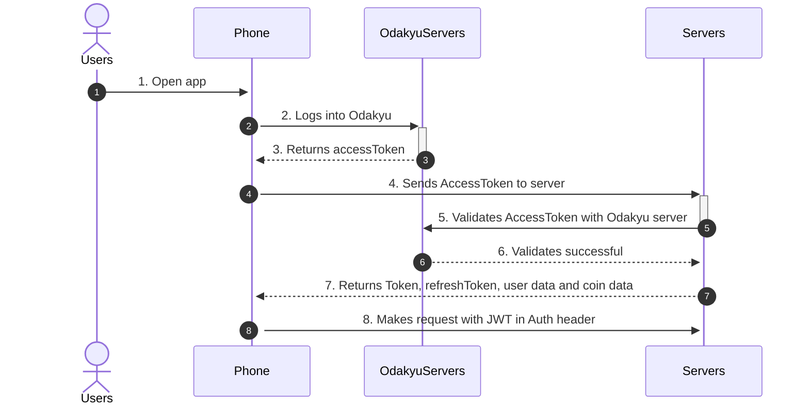

# bds

## Project setup
```
npm install
```

### Compiles and hot-reloads for development
```
npm run serve
```

### Compiles and minifies for production
```
npm run build
```

### Lints and fixes files
```
npm run lint
```

### Customize configuration
See [Configuration Reference](https://cli.vuejs.org/config/). <br/>
#List library <br/>
LocalStorage: https://www.npmjs.com/package/node-localstorage\ <br/>
VUE SESSION: https://www.npmjs.com/package/vue-session\ <br/>
VUE ROUTE: https://www.npmjs.com/package/vue-router\ <br/>
VUE MC: https://www.npmjs.com/package/vue-mc\ <br/>
Bootstrap VUE: https://www.npmjs.com/package/bootstrap-vue\ <br/>
Loading: https://www.npmjs.com/package/vue-loading-overlay\ <br/>
JWT: https://www.npmjs.com/package/jsonwebtoken\ <br/>
DOTENV: https://www.npmjs.com/package/dotenv\ <br/>
VUE FILE AGENT: https://www.npmjs.com/package/vue-file-agent\ <br/>
VUE SKELETON: https://www.npmjs.com/package/vue-skeleton-component\ <br/>
Moment: https://www.npmjs.com/package/moment\ <br/>
BOOTSTRAP DATE PICKER: https://www.npmjs.com/package/vue-bootstrap-datetimepicker\ <br/>
VUE SELECT 2: https://www.npmjs.com/package/v-select2-component\ <br/>
VUE RANGE SLIDER: https://github.com/xwpongithub/vue-range-slider (IN PACKAGE.json using: "vue-range-component": "Anoesj/vue-range-slider#master",)\ <br/>
FORMAT NUMBER: https://www.npmjs.com/package/format-number\ <br/>
VUE LAZY LOAD: https://www.npmjs.com/package/vue-lazyload\ <br/>
FORMAT NUMBER: https://www.npmjs.com/package/format-number\ <br/>
VUE SCROLL: https://www.npmjs.com/package/vuescroll\ <br/>
VUE TINYCME: https://reposhub.com/vuejs/rich-text-editing/dyonir-vue-tinymce-editor.html <br/>
HTML PURIFIER: https://openbase.io/js/html-purify/documentation <br/>
VUE CHARTS: https://www.npmjs.com/package/vue-chartjs <br/>

## Sequence diagram login with Odakyu Authentication



